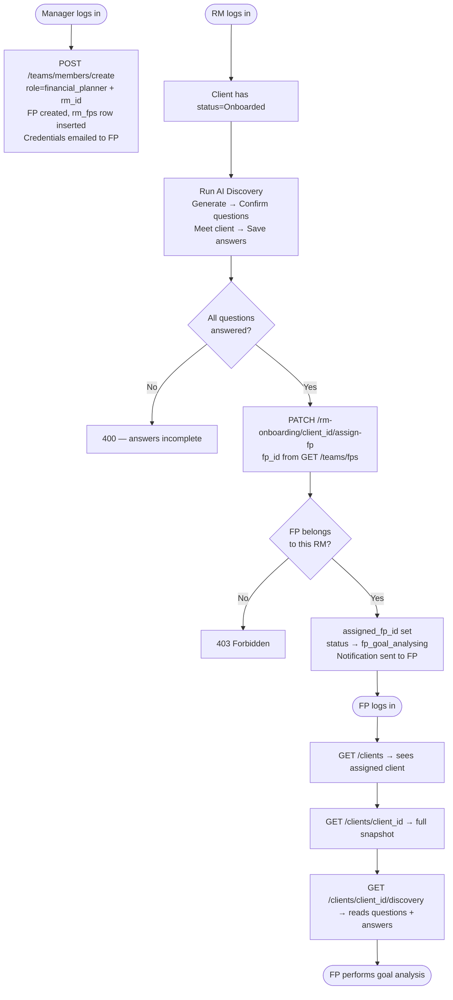

## test


# RM → FP Assignment Flow

## Overview

After a client is onboarded (status `Onboarded`), the assigned RM runs an AI-powered discovery session to understand the client's goals. Once all discovery questions are answered, the RM assigns a Financial Planner (FP) to the client. The FP then performs goal analysis.

```
Client Onboarded → RM runs AI Discovery → All questions answered → RM assigns FP → fp_goal_analysing
```

---

## Roles Involved

| Role | Responsibility in this flow |
|---|---|
| `manager` | Creates FP users, links them to an RM |
| `relationship_manager` (RM) | Runs discovery, assigns FP to client |
| `financial_planner` (FP) | Receives assigned client, performs goal analysis |

---

## Database Tables

### `teams`
Organises users into named teams (e.g. `team_arjun`).

| Column | Type | Notes |
|---|---|---|
| `id` | String PK | UUID |
| `name` | String | Unique team name |
| `assistant_manager_id` | String FK → users | Nullable |
| `created_at` | DateTime | Auto-set |

### `rm_fps`
Stores the RM → FP reporting relationship. An RM can have multiple FPs; an FP belongs to exactly one RM.

| Column | Type | Notes |
|---|---|---|
| `id` | String PK | UUID |
| `rm_id` | String FK → users | The RM |
| `fp_id` | String FK → users | The FP under that RM |
| `created_at` | DateTime | Auto-set |

### `client_onboarding` — relevant columns

| Column | Added for this flow |
|---|---|
| `assigned_fp_id` | FK → users.id — set when RM assigns FP |
| `onboarding_status` | Transitions to `fp_goal_analysing` on FP assignment |

---

## Step 1 — Manager Creates FP User

**Endpoint:** `POST /api/v1/teams/members/create`
**Auth:** `manager` only

```json
{
  "name": "Priya Mehta",
  "email": "priya@company.com",
  "role": "financial_planner",
  "rm_id": "<rm_user_id>"
}
```

**What happens:**
1. Validates the RM exists and has a team
2. Creates the FP user with `team_id` inherited from the RM's team
3. Creates an `rm_fps` row linking `rm_id → fp_id`
4. Auto-generates a password and emails credentials to the FP

**Rules:**
- `rm_id` is required when creating an FP — the FP must belong to an RM
- FP inherits the RM's `team_id` automatically
- BD and manager roles have no `team_id`
- RM / AM roles require `team_id` from payload

---

## Step 2 — RM Runs AI Discovery

See `Rm_AI_Discovery.md` for the full discovery flow.

**Summary:**
1. `POST /api/v1/clients/{client_id}/discovery/ai-questions` — AI generates question suggestions
2. `POST /api/v1/clients/{client_id}/discovery/questions` — RM confirms and saves the question list
3. RM meets with the client and records answers
4. `POST /api/v1/clients/{client_id}/discovery/answers` — RM saves all answers

**Auth:** `require_rm` (RM, AM, Manager)

---

## Step 3 — RM Assigns FP to Client

**Endpoint:** `PATCH /api/v1/rm-onboarding/{client_id}/assign-fp`
**Auth:** `relationship_manager` only (must be the assigned RM for this client)

```json
{
  "fp_id": "<fp_user_id>"
}
```

### Precondition checks (400 if not met)

| Check | Error message |
|---|---|
| Discovery questions exist for this client | `"AI discovery has not been completed for this client. Please generate and confirm discovery questions before assigning an FP."` |
| All questions have answers saved | `"Not all discovery questions have been answered for this client. Please ensure all answers are saved before assigning an FP."` |

### Authorization check (403 if fails)

| Check | Error message |
|---|---|
| FP belongs to the calling RM (entry in `rm_fps`) | `"The selected FP is not under your management."` |

### On success

1. Sets `client_onboarding.assigned_fp_id = fp_id`
2. Sets `client_onboarding.onboarding_status = fp_goal_analysing`
3. Creates a notification for the FP:
   - `type`: `client_assigned`
   - `title`: `"New client assigned to you"`
   - `body`: `"<Client name> has been assigned to you for goal analysis."`

**Response:**
```json
{
  "client_id": "...",
  "fp_id": "...",
  "onboarding_status": "fp_goal_analysing",
  "message": "FP assigned successfully."
}
```

---

## FP Access

Once assigned, the FP can:

| Endpoint | Access |
|---|---|
| `GET /api/v1/clients` | Returns only clients where `assigned_fp_id = fp_user_id` |
| `GET /api/v1/clients/{client_id}` | Allowed if `assigned_fp_id = fp_user_id`; 403 otherwise |
| `GET /api/v1/clients/{client_id}/discovery` | Read-only access to discovery questions and answers |

---

## Supporting Endpoints

### List FPs under the logged-in RM

`GET /api/v1/teams/fps`
**Auth:** `require_rm`
Returns only FPs linked to the calling RM via `rm_fps` table.

```json
[
  {
    "user_id": "...",
    "name": "Priya Mehta",
    "email": "priya@company.com",
    "team_id": "...",
    "team_name": "team_arjun",
    "is_active": true
  }
]
```

### List all RMs (for Manager / BD)

`GET /api/v1/users/rm`
**Auth:** `require_bd_or_manager` (BD and Manager)
Returns all users with `role = relationship_manager`.

### List all teams

`GET /api/v1/teams/list`
**Auth:** `require_manager`
Returns all teams with their assistant manager info.

---

## Status Transition Summary

```
bd_in_progress
      ↓  (BD submits to RM)
rm_awaiting
      ↓  (RM reviews and marks complete)
Onboarded           ← also set directly for Path C (RM doc extraction)
      ↓  (RM assigns FP after discovery)
fp_goal_analysing
```

---

## Flow Diagram


