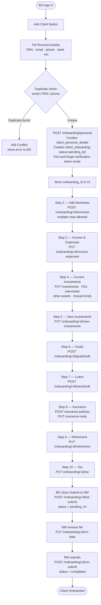
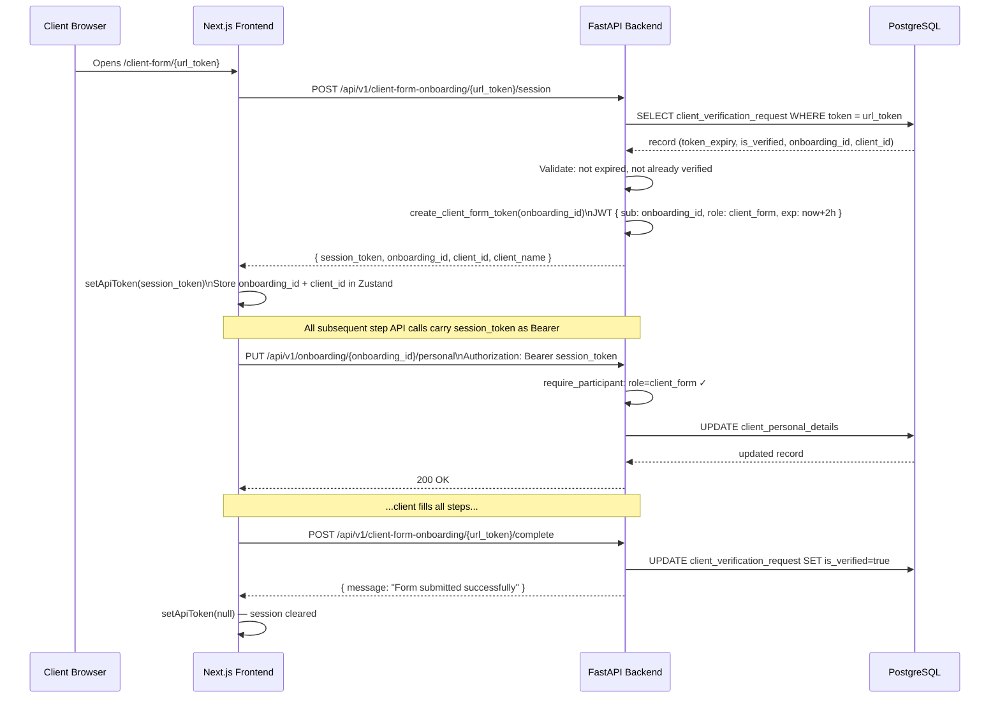

# test

# Client Onboarding — Complete Flow Documentation

## Overview

Vanguard supports two distinct ways to onboard a client. Both paths create the same set of database records and ultimately result in a fully onboarded client, but they differ in who fills the data and how.

| | Path A — BD Manual | Path B — Client Email Invite |
|---|---|---|
| **Who fills the form** | Business Developer (BD) on behalf of the client | The client themselves via a private link |
| **Entry point** | BD Dashboard → Add Client | BD Dashboard → Invite Client |
| **Authentication** | BD's own JWT (`role: business_developer`) | URL token → short-lived session JWT (`role: client_form`) |
| **Steps filled** | All 8 steps (personal, nominees, income, investments, goals, loans, insurance, tax) | Steps 1–5 (personal, nominees, income, current investments, new investments, goals) |
| **What happens after** | BD submits to RM → RM completes the file | BD and RM verify, fill remaining steps, submit |

---

## Roles & Authentication

The system has the following internal roles relevant to onboarding:

- **`business_developer` (BD)** — initiates onboarding, fills forms, invites clients, submits to RM
- **`relationship_manager` (RM)** — receives handed-off clients, fills RM-side data, marks completed
- **`client_form`** — a synthetic role embedded only in short-lived session JWTs issued to clients when they access their form via email link; never stored in the `users` table

Every protected API endpoint uses one of two FastAPI dependency guards:

- `require_bd` — only `business_developer` role allowed
- `require_participant` — allows both `business_developer` and `client_form` roles

This means once a client has exchanged their email link for a session JWT, they can call the same step-level endpoints (personal update, nominees, income-expenses, investments, goals) that the BD uses — no separate client-facing API needed.

---

## Database Records Created

Both paths create or populate the same set of tables. The `client_personal_details` record is the root — everything else links to it via `client_id`.

```
client_personal_details       ← root record (full_name, email, PAN, DOB, bank, etc.)
client_onboarding             ← status tracker (assigned_bd_id, assigned_rm_id, onboarding_status)
client_verification_request   ← tracks the email link token (used in Path B only for the form link)
client_nominees               ← one row per nominee (multi-row)
client_income_expenses        ← single row
client_investments            ← current investments summary (single row)
client_fixed_deposits         ← one row per FD (multi-row)
client_real_estate            ← one row per property (multi-row)
client_other_assets           ← one row per asset (multi-row)
client_mutual_funds           ← one row per fund (multi-row)
client_new_investments        ← intended new investments (single row)
client_goals                  ← one row per goal (multi-row)
client_loans                  ← one row per loan (multi-row)
client_insurance_policies     ← one row per policy (multi-row)
client_insurance_meta         ← life cover, retirement corpus, will status (single row)
client_retirement_plan        ← retirement projection inputs (single row)
client_tax_details            ← tax regime, deductions (single row)
client_rm_data                ← RM-side data filled post-handoff (single row)
```

`onboarding_status` on `client_onboarding` progresses through: `pending_bd` → `pending_rm` → `completed`.

---

## Path A — BD Manual Onboarding

The BD sits with the client (or works from notes) and fills the entire form on their behalf inside the Vanguard dashboard.

### Step 1 — Personal Details

BD navigates to Add Client and fills:
- Full name, DOB, contact numbers (primary, office, residence), email, STD code
- PAN number, Aadhaar, place of birth, occupation, annual income, designation/rank
- Bank details (bank name, account number, IFSC, MICR, branch address)
- Family (father's name, mother's name, marriage anniversary, retirement date)
- KYC status, risk score
- Optionally assigns an RM at this point (`assigned_rm_id`)

On save, `POST /api/v1/onboarding/personal` is called. This:
1. Validates no existing client has the same email, PAN, or phone number (returns `409 Conflict` if duplicate found)
2. Creates a `client_personal_details` row
3. Creates a `client_onboarding` row with `assigned_bd_id` taken from the JWT and `onboarding_status = pending_bd`
4. Fire-and-forgets a verification token email to the client (background task, does not block the API response)

The response returns `{ onboarding_id, client_id }`. The `onboarding_id` is stored in the frontend and used for all subsequent steps.

### Step 2 — Nominees

BD adds one or more nominees via `POST /api/v1/onboarding/:onboarding_id/nominee`. Each call creates one row in `client_nominees`. The nominee's PAN must be unique per client. BD can also edit or delete nominees at any time.

### Step 3 — Income & Expenses

BD fills monthly income and monthly expenses via `PUT /api/v1/onboarding/:onboarding_id/income-expenses`. This is an upsert — one row per client.

### Step 4 — Current Investments (multi-section)

Current investments are split into sub-sections, each saving to its own table:

- **4a — Investment summary**: DSOPF contributions, DSOPF balance, stocks count and value, savings bank balances → `client_investments`
- **4b — Fixed deposits**: one row per FD → `client_fixed_deposits`
- **4c — Real estate**: one row per property → `client_real_estate`
- **4d — Other assets**: one row per asset type → `client_other_assets`
- **4e — Mutual funds**: one row per fund → `client_mutual_funds`

### Step 5 — New Investments

BD fills the client's intended new lump-sum investment and monthly SIP amount via `PUT /api/v1/onboarding/:onboarding_id/new-investments` → `client_new_investments`.

### Step 6 — Goals

BD adds one or more goals via `POST /api/v1/onboarding/:onboarding_id/goals/bulk` (or individually). Each goal stores: priority, goal name, target year, present cost.

### Step 7 — Loans

BD adds each loan separately via `POST /api/v1/onboarding/:onboarding_id/loans/bulk`. Each row stores: loan type, amount, EMI, date taken, interest rate, balance, outstanding tenure.

### Step 8 — Insurance

Split into two sub-sections:
- **Insurance policies**: one row per policy (name, dates, cover amount, premium) → `client_insurance_policies`
- **Insurance meta**: existing life cover total, investable retirement corpus, will status → `client_insurance_meta`

### Step 9 — Retirement

BD fills retirement projection inputs via `PUT /api/v1/onboarding/:onboarding_id/retirement` → `client_retirement_plan`.

### BD Submit

Once all sections are filled, BD clicks Submit to RM. This calls `POST /api/v1/onboarding/:onboarding_id/bd-submit`, which:
1. Sets `onboarding_status = pending_rm`
2. Sets `bd_submitted_at = now()`

The client now appears in the RM's queue. RM fills `client_rm_data` and calls `POST /api/v1/onboarding/:onboarding_id/rm-submit` to mark `onboarding_status = completed`.

---

## Path B — Client Email Invite

The BD knows only the client's name and email. The client fills their own financial details remotely via a secure single-use form link.

### Phase 1 — BD Sends the Invite

BD goes to the Invite Client panel and submits just `{ full_name, email }` via `POST /api/v1/onboarding/invite`.

The `ClientFormOnboardingService.invite_client()` method:
1. Checks no existing client has that email (returns `409 Conflict` if duplicate)
2. Creates a minimal `client_personal_details` row (only `full_name` and `email` at this point)
3. Creates a `client_onboarding` row with `assigned_bd_id` from JWT and `onboarding_status = pending_bd`
4. Generates a cryptographically random URL token (a UUID4 hex string)
5. Saves the token to `client_verification_request` with a 1-week expiry (`token_expiry`)
6. Fire-and-forgets an SMTP email (background `asyncio.create_task`) so the invite API returns immediately without waiting for SMTP

The email body contains a link in the form:
```
{FRONTEND_URL}/client-form/{token}
```

### Phase 2 — Client Opens the Link

The client receives the email and clicks the link. The browser opens the Next.js page at `/client-form/[token]`.

On mount, the page calls `POST /api/v1/client-form-onboarding/{token}/session`.

The `ClientFormOnboardingService.create_client_form_session()` method:
1. Looks up the token in `client_verification_request`
2. Validates it exists, has not expired (`token_expiry > now()`), and `is_verified = false`
3. If valid, calls `create_client_form_token(onboarding_id)` which generates a short-lived JWT with `{ sub: onboarding_id, role: "client_form" }` and a 2-hour expiry
4. Returns `{ session_token, onboarding_id, client_id, client_name }`

The frontend stores the session JWT in memory (not localStorage) using `setApiToken()`, which injects it into the Axios interceptor for all subsequent API calls. The store is pre-seeded with `onboarding_id` and `client_id`.

### Phase 3 — Client Fills the Multi-Step Form

The client sees the same multi-step form the BD uses, rendered on a minimal public page (no sidebar, no auth). Steps shown:

| Step | Section | API called |
|---|---|---|
| 1 | Personal Details | `PUT /api/v1/onboarding/:onboarding_id/personal` |
| 2 | Nominees | `POST/PUT/DELETE /api/v1/onboarding/:onboarding_id/nominee` |
| 3 | Income & Expenses | `PUT /api/v1/onboarding/:onboarding_id/income-expenses` |
| 4 | Current Investments | `PUT /api/v1/onboarding/:onboarding_id/investments` + FDs, real estate, other assets, mutual funds |
| 5 | New Investments & Goals | `PUT /api/v1/onboarding/:onboarding_id/new-investments` + goals |

All these endpoints use `require_participant`, which allows the `client_form` JWT. So the client authenticates with their session JWT just like a BD would with their login JWT — no separate endpoint layer needed.

### Phase 4 — Client Submits

After the final step, the frontend calls `POST /api/v1/client-form-onboarding/{token}/complete`.

`ClientFormOnboardingService.complete_client_form()`:
1. Looks up the token in `client_verification_request`
2. If `is_verified` is already `true`, it is a no-op (idempotent)
3. Otherwise sets `is_verified = true` and `verified_at = now()`

The frontend then clears the session JWT (`setApiToken(null)`) and shows a success screen. The client cannot access the form again — subsequent visits to the same link will return a `400 Bad Request` ("This form has already been submitted").

### Phase 5 — BD/RM Complete the File

The client has now filled personal, nominees, income, investments, and goals. Remaining sections (loans, insurance, retirement, tax) are filled by the BD or RM inside the dashboard via the same onboarding endpoints. Once all data is complete, BD assigns RM and submits. RM fills `client_rm_data` and marks the onboarding completed.

---

## Key Validation Rules

- **Duplicate email**: Rejected at both `POST /onboarding/personal` and `POST /onboarding/invite` with `409 Conflict`
- **Duplicate phone**: Rejected at `POST /onboarding/personal` with `409 Conflict`
- **Duplicate PAN**: Rejected at `POST /onboarding/personal` with `409 Conflict`
- **Duplicate nominee PAN**: Rejected per client at nominee add/update with `409 Conflict`
- **Expired form link**: Token checked against `token_expiry`; expired → `400 Bad Request`
- **Already submitted form**: `is_verified = true` → `400 Bad Request` on re-access
- **Email is lowercased** on store to prevent case-sensitive duplicates

---

## Security Notes

- The URL token (`client_verification_request.token`) is a random UUID4 hex string — not a JWT. It is only used to exchange for a JWT session token. It is never used directly for authenticated API calls.
- The session JWT (`role: client_form`) has a 2-hour TTL. If the client's session expires mid-form, they must revisit the email link to get a new session JWT (as long as the URL token itself has not expired within its 1-week window).
- The URL token's 1-week expiry is stored server-side in the database. It cannot be extended without a new invite.

---

## Flow Diagrams

### Path A — BD Manual Onboarding



---

### Path B — Client Email Invite

```mermaid
flowchart TD
    A([BD logs in]) --> B[Invite Client panel\nEnter client name + email only]
    B --> C{Duplicate email check}
    C -- Duplicate --> D[409 Conflict\nshow error to BD]
    C -- Unique --> E[POST /onboarding/invite\nCreates minimal client_personal_details\nCreates client_onboarding status=pending_bd\nGenerates URL token → stored in client_verification_request\nexpiry = 7 days]
    E --> F[Fire-and-forget SMTP email\nlink = FRONTEND_URL/client-form/token\nBD API returns immediately]
    F --> G([Client receives email])
    G --> H[Client clicks secure link\nbrowser opens /client-form/token]
    H --> I[POST /client-form-onboarding/token/session\nValidate token not expired and not used\nIssue short-lived session JWT\nrole=client_form · sub=onboarding_id · TTL=2h]
    I --> J[Frontend stores session JWT in memory\nsetApiToken — injected into Axios interceptor\nStore seeded with onboarding_id + client_id]
    J --> K[Step 1 — Personal Details\nPUT /onboarding/:id/personal\nrequire_participant accepts client_form JWT]
    K --> L[Step 2 — Nominees\nPOST/PUT/DELETE /onboarding/:id/nominee]
    L --> M[Step 3 — Income & Expenses\nPUT /onboarding/:id/income-expenses]
    M --> N[Step 4 — Current Investments\nPUT investments + FDs + real-estate\nother-assets + mutual-funds]
    N --> O[Step 5 — New Investments & Goals\nPUT new-investments · POST goals]
    O --> P[POST /client-form-onboarding/token/complete\nMark is_verified=true in client_verification_request\nIdempotent — no-op if already done]
    P --> Q[Frontend clears session JWT\nsetApiToken null\nShows success screen]
    Q --> R[Link is now single-use\nRe-visiting returns 400 Already Submitted]
    R --> S([BD/RM fill remaining steps\nloans · insurance · retirement · tax\nvia dashboard as usual])
    S --> T[BD assigns RM\nPUT /onboarding/:id/assign-rm\nstatus = pending_rm]
    T --> U[RM submits\nPOST /onboarding/:id/rm-submit\nstatus = completed]
    U --> V([Client Onboarded])
```



---

### Token Exchange Detail (Path B only)


