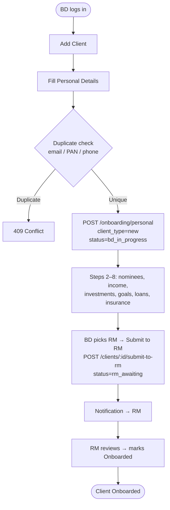
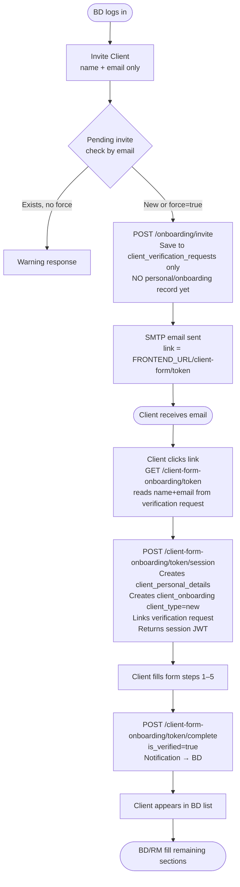
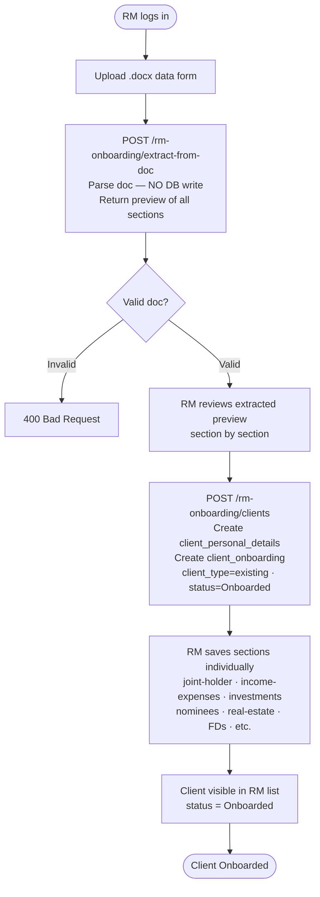

## test
# Client Onboarding — Complete Flow Documentation

## Overview

Vanguard supports three distinct ways to onboard a client. All paths ultimately result in a fully onboarded client but differ in who fills the data, how it enters the system, and what the client's `client_type` is.

| | Path A — BD Manual | Path B — Client Email Invite | Path C — RM Doc Extraction |
|---|---|---|---|
| **Who fills the form** | Business Developer (BD) on behalf of the client | The client themselves via a private link | Relationship Manager (RM) via document upload |
| **Entry point** | BD Dashboard → Add Client | BD Dashboard → Invite Client | RM Dashboard → Upload Doc |
| **Authentication** | BD's JWT (`role: business_developer`) | URL token → session JWT (`role: client_form`) | RM's JWT (`role: relationship_manager`) |
| **client_type** | `new` | `new` | `existing` |
| **Status on creation** | `bd_in_progress` | `bd_in_progress` | `Onboarded` |
| **Visible to** | Assigned BD | Assigned BD (only after form submitted) | Creating RM only |

---

## Roles & Authentication

- **`business_developer` (BD)** — initiates onboarding, fills forms, invites clients, submits to RM
- **`relationship_manager` (RM)** — receives handed-off clients, fills RM-side data, can also directly onboard existing clients via doc upload
- **`client_form`** — synthetic role embedded only in short-lived session JWTs issued to clients when they access their form via email link; never stored in the `users` table

FastAPI dependency guards:
- `require_bd` — only `business_developer` role allowed
- `require_participant` — allows both `business_developer` and `client_form` roles
- `get_current_user` — any authenticated user; service layer enforces role checks

---

## Database Records

All paths write to the same tables. `client_personal_details` is the root — everything else links via `client_id`.

```
client_personal_details       ← root record (full_name, email, PAN, DOB, bank, etc.)
client_onboarding             ← status tracker (assigned_bd_id, assigned_rm_id, onboarding_status, client_type)
client_verification_requests  ← invite token store (full_name, email, assigned_bd_id, token — Path B only)
client_nominees               ← one row per nominee
client_income_expenses        ← single row
client_investments            ← current investments summary (single row)
client_fixed_deposits         ← one row per FD
client_real_estate            ← one row per property
client_other_assets           ← one row per asset
client_mutual_funds           ← one row per fund
client_new_investments        ← intended new investments (single row)
client_goals                  ← one row per goal
client_loans                  ← one row per loan
client_insurance_policies     ← one row per policy
notifications                 ← in-app notifications
```

### `client_type` column on `client_onboarding`

| Value | Set by | Meaning |
|---|---|---|
| `new` | Path A (BD manual) or Path B (invite) | Client is new to the organisation |
| `existing` | Path C (RM doc extraction) | Client already exists; RM is migrating their data |

### `onboarding_status` progression

- Path A / B: `bd_in_progress` → `rm_awaiting` → `Onboarded`
- Path C: `Onboarded` (set immediately at creation)

---

## Path A — BD Manual Onboarding

BD fills the entire form on behalf of the client inside the dashboard.

### Step 1 — Personal Details

`POST /api/v1/onboarding/personal`
- Validates no duplicate email / PAN / phone (`409 Conflict` if found)
- Creates `client_personal_details`
- Creates `client_onboarding` with `assigned_bd_id` from JWT, `onboarding_status = bd_in_progress`, `client_type = new`
- Returns `{ onboarding_id, client_id }`

### Steps 2–8

| Step | Section | Endpoint |
|---|---|---|
| 2 | Nominees | `POST /api/v1/onboarding/:onboarding_id/nominee` |
| 3 | Income & Expenses | `PUT /api/v1/onboarding/:onboarding_id/income-expenses` |
| 4a | Investments summary | `PUT /api/v1/onboarding/:onboarding_id/investments` |
| 4b | Fixed Deposits | `POST /api/v1/onboarding/:onboarding_id/fixed-deposits` |
| 4c | Real Estate | `POST /api/v1/onboarding/:onboarding_id/real-estate` |
| 4d | Other Assets | `POST /api/v1/onboarding/:onboarding_id/other-assets` |
| 4e | Mutual Funds | `POST /api/v1/onboarding/:onboarding_id/mutual-funds` |
| 5 | New Investments | `PUT /api/v1/onboarding/:onboarding_id/new-investments` |
| 6 | Goals | `POST /api/v1/onboarding/:onboarding_id/goals` |
| 7 | Loans | `POST /api/v1/onboarding/:onboarding_id/loans` |
| 8 | Insurance | `POST /api/v1/onboarding/:onboarding_id/insurance-policies` |

### BD Submit to RM

`POST /api/v1/clients/{client_id}/submit-to-rm` with `{ rm_user_id }`
1. Verifies target user exists with role `relationship_manager`
2. Sets `assigned_rm_id`, `onboarding_status = rm_awaiting`, `bd_submitted_at = now()`
3. Creates notification for RM: *"[Client name] has been assigned to you for onboarding review."* (`type: client_assigned`)

---

## Path B — Client Email Invite

BD knows only the client's name and email. The client fills their own data remotely via a secure link.

### Phase 1 — BD Sends the Invite

`POST /api/v1/onboarding/invite` with `{ full_name, email }`

**No `client_personal_details` or `client_onboarding` records are created at this point.**

The service:
1. Checks for an existing pending invite with the same email (warns BD if found, `force: true` to re-invite)
2. Saves only to `client_verification_requests`: `full_name`, `email`, `assigned_bd_id`, `token`, `token_expiry` (7 days), `sent_at`
3. Fire-and-forgets an SMTP email with link: `{FRONTEND_URL}/client-form/{token}`

The client does **not** appear in the BD's client list at this stage.

### BD Invite List

`GET /api/v1/onboarding/invites`

Returns all invites sent by the BD with summary stats and per-invite status:

```json
{
  "total": 4,
  "filled": 1,
  "pending": 3,
  "invites": [
    {
      "id": "...",
      "full_name": "Priya Sharma",
      "email": "priya.sharma@email.com",
      "status": "client_filled",
      "date": "2026-05-11T08:02:00Z",
      "date_label": "Filled on"
    },
    {
      "id": "...",
      "full_name": "Rohit Verma",
      "email": "rohit.verma@email.com",
      "status": "email_sent",
      "date": "2026-05-12T04:30:00Z",
      "date_label": "Sent on"
    }
  ]
}
```

`status` values: `email_sent` (pending) | `client_filled` (submitted)

### Phase 2 — Client Opens the Link

`GET /api/v1/client-form-onboarding/{token}`
- Reads `full_name` and `email` directly from `client_verification_requests`
- No DB writes

### Phase 3 — Client Starts Session

`POST /api/v1/client-form-onboarding/{token}/session`
- Validates token (not expired, not verified)
- **Creates `client_personal_details` and `client_onboarding`** (`client_type = new`) at this point
- Links verification request to the new records (`client_id`, `onboarding_id`)
- Returns a short-lived session JWT (`role: client_form`, TTL: 2h)

### Phase 4 — Client Fills the Form

Client fills steps 1–5 using the session JWT (same endpoints as BD, `require_participant` guard):

| Step | Section | Endpoint |
|---|---|---|
| 1 | Personal Details | `PUT /api/v1/onboarding/:onboarding_id/personal` |
| 2 | Nominees | `POST/PUT/DELETE /api/v1/onboarding/:onboarding_id/nominee` |
| 3 | Income & Expenses | `PUT /api/v1/onboarding/:onboarding_id/income-expenses` |
| 4 | Current Investments | investments + FDs + real estate + other assets + mutual funds |
| 5 | New Investments & Goals | new-investments + goals |

### Phase 5 — Client Submits

`POST /api/v1/client-form-onboarding/{token}/complete`
- Marks `is_verified = true`, `verified_at = now()` (idempotent)
- Creates notification for BD: *"[Client name] has submitted their onboarding form."* (`type: form_submitted`)
- **Client now appears in BD's client list**
- Link becomes single-use — re-visiting returns `400 Already Submitted`

### Phase 6 — BD/RM Complete Remaining Sections

BD fills remaining sections (loans, insurance) in the dashboard, assigns RM, and submits.

---

## Path C — RM Doc Extraction (Existing Client Onboarding)

RM uploads a `.docx` data form template. The system extracts all client data, shows it as a preview, and the RM saves each section individually. Used when the client's data already exists on paper.

**All endpoints require `role: relationship_manager`. Only the RM who created the client can save sections for that client.**

### Step 1 — Extract from Doc (no DB write)

`POST /api/v1/rm-onboarding/extract-from-doc` — `multipart/form-data` with `file`

- Validates the file is a valid `.docx` using the prescribed template (400 if not)
- Validates `full_name` is extractable (400 if template not recognised)
- Returns `RMExtractionPreviewResponse` — all extracted sections as raw preview data
- **Nothing is written to the database**

```json
{
  "personal_details": { "full_name": "...", "pan_no": "...", ... },
  "joint_holder": { ... },
  "nominees": [ ... ],
  "income_expenses": { ... },
  "investments": { ... },
  "new_investments": { ... },
  "real_estate": [ ... ],
  "fixed_deposits": [ ... ],
  "mutual_funds": [ ... ],
  "loans": [ ... ],
  "insurance_policies": [ ... ],
  "other_assets": [ ... ],
  "goals": [ ... ]
}
```

### Step 2 — Create Client Record

`POST /api/v1/rm-onboarding/clients` with `{ personal_details: { ... } }`

- Validates no duplicate PAN / email / contact (`409 Conflict` if found)
- Creates `client_personal_details`
- Creates `client_onboarding` with `assigned_bd_id = rm_user_id` (placeholder), `assigned_rm_id = rm_user_id`, `onboarding_status = Onboarded`, `client_type = existing`
- Returns `{ client_id, onboarding_id }`

**Phone number cleanup:** `contact_no` values extracted from the document often contain multiple numbers in one cell (e.g. `"7542941197 9135658524"`). The service normalises this by extracting the **first exactly 10-digit number** found in the raw string — any secondary numbers are discarded. If no 10-digit group is found, all non-digit characters are stripped and the result is truncated to 10 digits.

Client is immediately visible in the RM's list with status `Onboarded`.

### Step 3 — Save Sections Individually

RM reviews each extracted section and saves it. Each endpoint is independent — sections can be saved in any order.

| Method | Endpoint | Body | Purpose |
|---|---|---|---|
| `PUT` | `/rm-onboarding/{client_id}/joint-holder` | `UpdateJointHolderRequest` | Save joint holder |
| `PUT` | `/rm-onboarding/{client_id}/income-expenses` | `UpdateIncomeExpensesRequest` | Save income & expenses |
| `PUT` | `/rm-onboarding/{client_id}/investments` | `UpdateInvestmentsRequest` | Save investments summary |
| `PUT` | `/rm-onboarding/{client_id}/new-investments` | `UpdateNewInvestmentsRequest` | Save new investments |
| `POST` | `/rm-onboarding/{client_id}/nominees` | `{ nominees: [...] }` | Save all nominees (batch) |
| `POST` | `/rm-onboarding/{client_id}/real-estate` | `{ items: [...] }` | Save all real estate (batch) |
| `POST` | `/rm-onboarding/{client_id}/fixed-deposits` | `{ items: [...] }` | Save all FDs (batch) |
| `POST` | `/rm-onboarding/{client_id}/mutual-funds` | `{ items: [...] }` | Save all mutual funds (batch) |
| `POST` | `/rm-onboarding/{client_id}/loans` | `{ items: [...] }` | Save all loans (batch) |
| `POST` | `/rm-onboarding/{client_id}/insurance-policies` | `{ items: [...] }` | Save all insurance (batch) |
| `POST` | `/rm-onboarding/{client_id}/other-assets` | `{ items: [...] }` | Save all other assets (batch) |
| `POST` | `/rm-onboarding/{client_id}/goals` | `{ goals: [...] }` | Save all goals (batch) |

**Notes:**
- `PUT` endpoints are upserts (one record per client)
- `POST` endpoints append all items in one batch — no edit/delete/add individually
- `assigned_bd_id` is set to the RM's own `user_id` as a placeholder to satisfy the NOT NULL FK constraint; it does not affect BD list scoping

---

## Notifications

| Event | Trigger | Recipient | `type` |
|---|---|---|---|
| BD submits client to RM | `POST /clients/{id}/submit-to-rm` | Assigned RM | `client_assigned` |
| Client submits form | `POST /client-form-onboarding/{token}/complete` | Assigned BD | `form_submitted` |

### Notification API

| Method | Path | Description |
|---|---|---|
| `GET` | `/api/v1/notifications` | List caller's notifications — unread first |
| `PATCH` | `/api/v1/notifications/{id}/read` | Mark single notification as read |
| `PATCH` | `/api/v1/notifications/read-all` | Mark all as read |

---

## Key Validation Rules

| Rule | Where enforced |
|---|---|
| Duplicate email | `POST /onboarding/personal`, `POST /rm-onboarding/clients` → `409` |
| Duplicate PAN | `POST /onboarding/personal`, `POST /rm-onboarding/clients` → `409` |
| Duplicate phone | `POST /onboarding/personal`, `POST /rm-onboarding/clients` → `409` |
| Phone number normalisation | RM doc extraction: first 10-digit group extracted; secondary numbers discarded |
| Invalid doc format | `POST /rm-onboarding/extract-from-doc` → `400` |
| Expired form link | Token `token_expiry < now()` → `400` |
| Already submitted form | `is_verified = true` → `400` |
| RM can only access own clients | `assigned_rm_id == user_id` check in service → `403` |
| Email stored lowercase | All paths |

---

## Code Structure

The RM Client Onboarding feature is fully separated from the BD onboarding code:

```
app/
  schemas/
    client.py                          ← shared snapshot + request schemas
    rm_client_onboarding.py            ← RM-specific schemas (preview + batch save requests)
  repositories/
    client_repository.py               ← BD client list queries
    onboarding_repository.py           ← BD onboarding DB operations
    rm_client_onboarding_repository.py ← RM onboarding DB operations (self-contained)
  services/
    client_service.py                  ← BD client service
    onboarding_service.py              ← BD onboarding service
    client_form_onboarding_service.py  ← Invite flow service
    rm_client_onboarding_service.py    ← RM onboarding service (self-contained)
  api/v1/routes/
    onboarding.py                      ← BD onboarding routes + invite + invite list
    client_form_onboarding.py          ← Client form token routes
    clients.py                         ← Client snapshot + submit-to-rm
    rm_client_onboarding.py            ← RM doc extraction + section save routes
```

---

## Flow Diagrams

### Path A — BD Manual Onboarding



### Path B — Client Email Invite



### Path C — RM Doc Extraction


