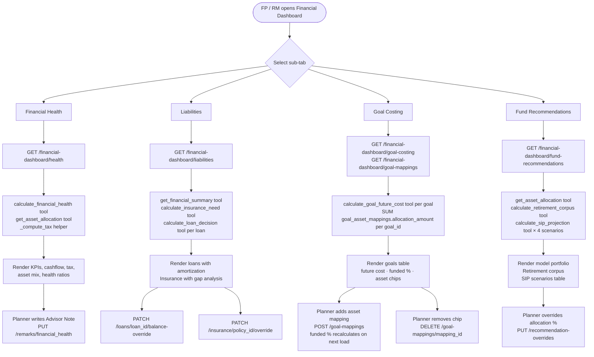

# Financial Dashboard — Complete Flow Documentation

**Who uses it:** Financial Planner (FP) and Relationship Manager (RM)  
**Auth guard:** `require_rm_or_fp` — `relationship_manager`, `assistant_manager`, `manager`, `financial_planner`  
**Routes file (read-only data):** `app/api/v1/routes/financial_dashboard.py`  
**Routes file (CRUD):** `app/api/v1/routes/financial_dashboard_data.py`  
**Router prefix:** `/api/v1/clients/{client_id}`

---

## Overview

The Financial Dashboard gives the FP/RM a computed view of a client's financial picture, split into four sub-tabs. Some values are editable by the planner (overrides, advisor notes, asset mappings) — the rest are calculated from data entered during onboarding.

---

## Database Tables (new — added for this feature)

| Table | Purpose |
|---|---|
| `goal_asset_mappings` | Planner maps a client asset to a goal with an allocation amount |
| `dashboard_recommendation_overrides` | Planner's chosen allocation % per asset class/category |
| `financial_dashboard_remarks` | Advisor notes per section (financial_health, liabilities, goal_costing, fund_recommendations) |
| `financial_dashboard_ai_summary` | Saved AI-generated summary text |

---

## Sub-tab 1 — Financial Health

**Endpoint:** `GET /{client_id}/financial-dashboard/health`

### What is returned

| Section | Fields |
|---|---|
| `kpis` | `net_worth`, `total_assets`, `total_liabilities`, `monthly_surplus` |
| `cashflow` | `monthly_gross_income`, `monthly_expenses`, `total_emi`, `total_existing_sip`, `monthly_surplus`, `investable_surplus`, `estimated_monthly_tax`, `net_monthly_income` |
| `tax` | Old regime vs New regime: `taxable_income`, `tax_liability`, `net_monthly_income`, `recommended_regime` |
| `risk_profile` | `risk_score`, `risk_label`, `risk_band_index` |
| `asset_allocation` | `current_equity_pct`, `current_debt_pct`, `recommended_equity_pct`, `recommended_debt_pct`, `recommended_commodity_pct`, `portfolio_type`, `model_portfolio` |
| `asset_breakdown` | Per-asset-type values, `total_liquid`, `total_illiquid`, `total_assets`, `total_liabilities`, `net_worth` |
| `health_ratios` | `liquidity_ratio`, `savings_ratio`, `debt_to_asset`, `solvency_ratio` — each with `value` and `status` |

### How each value is calculated

| Value | Source |
|---|---|
| Cashflow, net worth, health ratios | `calculate_financial_health` tool — reads DB directly |
| Tax (old & new regime) | `_compute_tax()` helper in API route — pure math, no tool |
| Risk score | Raw value from `get_client_snapshot` tool |
| Risk label | `_risk_label(score)` helper — hardcoded score bands |
| **Current** equity/debt % | API route: plain math on DB asset values (see formula below) |
| **Recommended** equity/debt/commodity % | `get_asset_allocation` tool — age-bracket rule table |

**Current Asset Mix formula:**
```python
equity_proxy     = stocks_value + (mutual_funds_value × 0.6)
financial_assets = savings_bank + mutual_funds + dsopf + stocks + fixed_deposits
current_equity_pct = equity_proxy / financial_assets × 100
current_debt_pct   = 100 - current_equity_pct
```
MFs are assumed 60% equity / 40% debt (actual fund-level split not stored during onboarding).

**Recommended allocation** is determined by client age bracket from `_AGE_ALLOCATION` table in `data_tools.py`. Younger clients get higher equity %, older clients get higher debt %.

---

## Sub-tab 2 — Liabilities

**Endpoint:** `GET /{client_id}/financial-dashboard/liabilities`

### Loans

| Field | Source |
|---|---|
| Loan name, amount, EMI, rate, tenure | DB — entered during onboarding |
| `balance_amount` | DB (original) |
| `balance_override` | Planner override (nullable) |
| `effective_balance` | `balance_override` if set, else `balance_amount` |
| `prepay_vs_invest` | `calculate_loan_decision` tool |
| `amortization_annual` | `_amortization_annual()` helper in API route |

**Prepay vs Invest** (`calculate_loan_decision` tool): Compares interest saved by prepaying vs future value if the same amount is invested at 12% equity MF. Returns `"PREPAY"` or `"INVEST"` verdict.

**Loan balance override:**
`PATCH /{client_id}/loans/{loan_id}/balance-override`
```json
{ "balance_override": 3500000 }   // or null to remove override
```

### Insurance

| Field | Source |
|---|---|
| Policy name, premium | DB — entered during onboarding, **not calculated** |
| `insurance_cover` | DB (original) |
| `insurance_type` | DB — editable by planner |
| `cover_override` | Planner override (nullable) |
| `effective_cover` | `cover_override` if set, else `insurance_cover` |

**Insurance Gap Analysis** (`calculate_insurance_need` tool): Needs-based method (income × 10 years − liabilities) vs 10× rule (annual income × 10). Returns `recommended_additional_cover` and recommendation text.

**Insurance override:**
`PATCH /{client_id}/insurance/{policy_id}/override`
```json
{ "insurance_type": "health", "cover_override": 1000000 }
```

---

## Sub-tab 3 — Goal Costing

**Endpoint:** `GET /{client_id}/financial-dashboard/goal-costing`

### What is returned

Per goal:

| Field | Source |
|---|---|
| Goal name, type, priority | DB |
| `present_cost` | DB — entered during onboarding |
| `target_year` / `time_frame` | DB |
| `inflation_rate` | Fixed constant by goal type |
| `future_cost` | `calculate_goal_future_cost` tool |
| `bulk_required_today` | `calculate_goal_future_cost` tool |
| `years_to_goal` | `target_year - current_year` or `time_frame` |
| `achieved_pct` (funded %) | API route — sum of allocations ÷ future cost |

### Future Cost formula

**Tool:** `calculate_goal_future_cost` in `calc_tools.py`

```python
future_cost = present_cost × (1 + inflation_rate) ^ years_to_goal
```

**Inflation rates (from `assumptions.py`):**

| Goal Type | Rate |
|---|---|
| `education` | 10% |
| `marriage` | 10% |
| `retirement` | 6% |
| `vehicle` | 6% |
| `lifestyle` | 6% |
| `emergency_fund` | 0% |
| `other` | 6% |

`bulk_required_today` = lump sum needed today to reach future cost, discounted at 7% / 10% / 12% based on time horizon (< 3 yrs / 3–7 yrs / > 7 yrs).

### Funded % formula

**No tool, no AI — plain math in the API route.**

```python
# Step 1: sum all allocations mapped to this goal
goal_allocations = {}
for mapping in goal_asset_mappings WHERE client_id = client_id:
    goal_allocations[mapping.goal_id] += mapping.allocation_amount

# Step 2: per goal
total_allocated = goal_allocations.get(goal_id, 0.0)

if years_to_goal == 0:
    achieved_pct = 100.0                                  # goal already reached
elif future_cost > 0 and total_allocated > 0:
    achieved_pct = min(100.0, total_allocated / future_cost × 100)
else:
    achieved_pct = 0.0
```

**Example:** Goal = Education, future cost = ₹50L. Planner maps FD ₹17L to this goal → funded % = 17/50 × 100 = **34%**.

### Goal Asset Mappings — CRUD

The planner maps a client's existing asset (e.g. FD, MF) to a specific goal with an amount to indicate how much of that asset funds this goal.

| Endpoint | Purpose |
|---|---|
| `GET /{client_id}/financial-dashboard/goal-mappings` | List all mappings |
| `POST /{client_id}/financial-dashboard/goal-mappings` | Create a mapping |
| `DELETE /{client_id}/financial-dashboard/goal-mappings/{mapping_id}` | Remove a mapping |

**Create payload:**
```json
{
  "goal_id": "uuid",
  "asset_type": "fixed_deposit",
  "asset_id": null,
  "allocation_amount": 1700000
}
```

Valid `asset_type` values: `savings_bank`, `mutual_fund`, `dsopf`, `stocks`, `fixed_deposit`, `real_estate`, `other_asset`

**Model:** `goal_asset_mappings` table → `app/models/goal_asset_mapping.py`

---

## Sub-tab 4 — Fund Recommendations

**Endpoint:** `GET /{client_id}/financial-dashboard/fund-recommendations`

### Recommended Asset Allocation

Same age-bracket rule as Financial Health tab — `get_asset_allocation` tool. Returns:
- Equity % / Debt % / Commodity %
- Portfolio type label
- `model_portfolio` — list of fund categories with allocation %
- `short_term_portfolios`, `debt_by_horizon`

### Retirement Corpus

**Tool:** `calculate_retirement_corpus` in `calc_tools.py`

```python
# Step 1: project expenses to retirement
expenses_at_retirement = monthly_expenses × (1.06)^years_to_retirement

# Step 2: corpus needed — 4% withdrawal rule
corpus_needed = (expenses_at_retirement × 12) / 0.04

# Step 3: monthly SIP required at 12% equity MF return
monthly_sip_required = corpus_needed / SIP_growth_factor
```

`retirement_age` is derived from client's `retirement_date` and `dob`. Defaults to 60 if not set.

### Step-Up SIP Scenarios

**Tool:** `calculate_sip_projection` in `calc_tools.py`

Four scenarios: Flat / 10% / 15% / 20% annual step-up. All use base SIP = ₹10,000 and 12% p.a. return. Tenure = `min(retirement_age − current_age, 25)` years.

**Flat SIP FV:**
```
FV = SIP × [((1+r)^n − 1) / r] × (1+r)
```

**Step-up SIP FV:**
```
FV = SIP × [((1+r)^n − (1+g)^n) / (r−g)] × (1+r)
where r = monthly return rate (12%/12), g = annual_stepup/12
```

**Total Contribution (step-up)** — calculated in API route, not tool:
```python
contribution = 12 × SIP × ((1 + stepup_pct)^years − 1) / stepup_pct
```

### Planner Allocation Override

FP can override the model portfolio allocation % for any fund category.

| Endpoint | Purpose |
|---|---|
| `GET /{client_id}/financial-dashboard/recommendation-overrides` | List all overrides |
| `PUT /{client_id}/financial-dashboard/recommendation-overrides` | Upsert one override |
| `DELETE /{client_id}/financial-dashboard/recommendation-overrides/{id}` | Delete override |

**Upsert payload:**
```json
{
  "goal_id": null,
  "asset_class": "equity",
  "category": "large_cap",
  "planner_pct": 40.0,
  "ai_pct": 35.0,
  "notes": "Increased due to client's higher risk appetite"
}
```

Unique key: `(client_id, goal_id, asset_class, category)` — upsert matches on all four.

> **Bug fixed (2026-06-06):** The upsert WHERE clause previously only matched on `asset_class`, causing all rows with the same asset class to update together. Fixed by including `category` in the match condition.

---

## Advisor's Notes — all tabs

**Endpoints:**
- `GET /{client_id}/financial-dashboard/remarks` — returns all saved notes for all sections
- `PUT /{client_id}/financial-dashboard/remarks/{section}` — upsert note for a section

Valid `section` values: `financial_health` | `liabilities` | `goal_costing` | `fund_recommendations`

**Model:** `financial_dashboard_remarks` table → `app/models/financial_dashboard_remarks.py`

```json
// PUT body
{ "remarks_text": "Client has low liquidity. Recommend building emergency fund first." }
```

---

## AI Summary

- `GET /{client_id}/financial-dashboard/ai-summary` — fetch latest saved summary
- `POST /{client_id}/financial-dashboard/ai-summary` — save a summary

```json
// POST body
{ "summary_text": "..." }
```

**Status:** Save/fetch is implemented. AI generation endpoint (which calls Gemini/LLM to generate the text) is pending — will be built by the AI engineer. The frontend button is present but disabled until then.

**Model:** `financial_dashboard_ai_summary` table → `app/models/financial_dashboard_ai_summary.py`

---

## Calculation Source Summary

| Value | Calculated by |
|---|---|
| Cashflow, net worth, health ratios | `calculate_financial_health` tool |
| Tax (old/new regime) | `_compute_tax()` in API route — pure math |
| Current equity/debt % | API route — `(stocks + MF×0.6) / financial_assets × 100` |
| Recommended allocation % | `get_asset_allocation` tool — age-bracket table |
| Future cost of goals | `calculate_goal_future_cost` tool — inflation formula |
| Bulk required today | `calculate_goal_future_cost` tool — discount rate formula |
| **Funded %** | API route — sum of `goal_asset_mappings.allocation_amount` / future cost |
| Loan amortization | `_amortization_annual()` in API route — EMI formula |
| Prepay vs Invest verdict | `calculate_loan_decision` tool |
| Insurance gap | `calculate_insurance_need` tool |
| Retirement corpus needed | `calculate_retirement_corpus` tool — 4% withdrawal rule |
| SIP scenario future values | `calculate_sip_projection` tool |
| SIP scenario contributions | `_stepup_total_contribution()` in API route — geometric series |
| Premium, policy cover, loan balances | DB only — entered during onboarding, no calculation |

---

## Code Structure

```
app/
  api/v1/routes/
    financial_dashboard.py          ← read-only GET endpoints (health, liabilities, goal-costing, fund-recommendations)
    financial_dashboard_data.py     ← CRUD endpoints (mappings, overrides, remarks, ai-summary, loan/insurance overrides)
  models/
    goal_asset_mapping.py
    dashboard_recommendation_override.py
    financial_dashboard_remarks.py
    financial_dashboard_ai_summary.py
  schemas/
    financial_dashboard.py          ← all request/response schemas for this feature
  tools/fp_agent/
    calc_tools.py                   ← calculate_financial_health, calculate_goal_future_cost,
                                       calculate_loan_decision, calculate_insurance_need,
                                       calculate_retirement_corpus, calculate_sip_projection
    data_tools.py                   ← get_asset_allocation, get_client_snapshot,
                                       get_financial_summary, get_existing_goals
  agents/fp_agent/
    assumptions.py                  ← INFLATION, RETURNS, DISCOUNT_RATES, health ratio thresholds
```

---

## Flow Diagram


